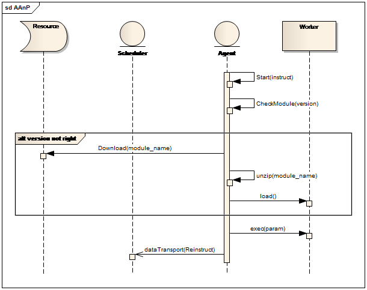
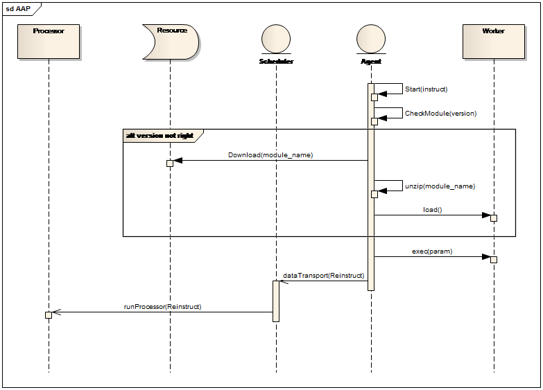
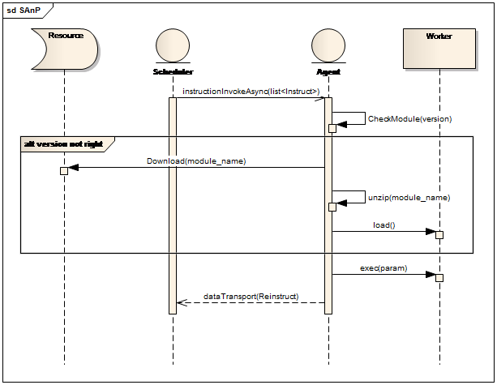
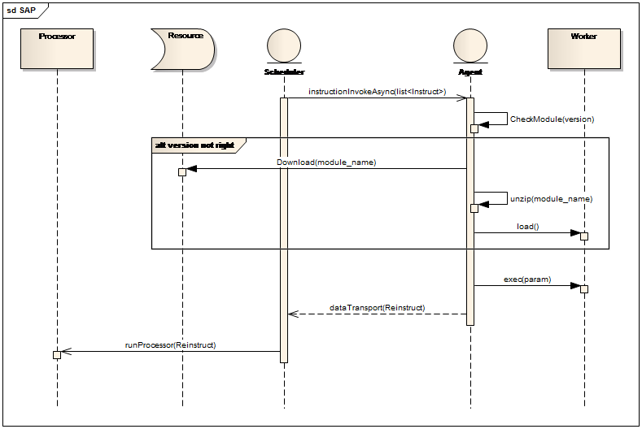
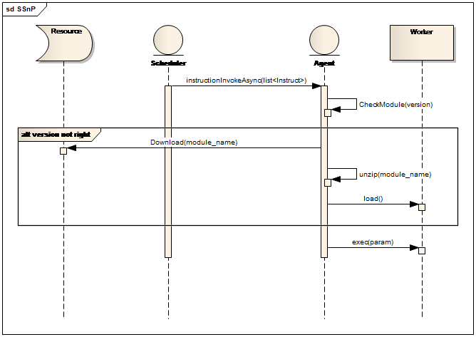

>**AAnP** | 工作模式：异步模式 | 发起方式：Agent发起 | 生命类型：非处理型

>**AAP** | 工作模式：异步模式  | 发起方式：Agent发起 | 生命类型：处理型

>**SAnP** | 工作模式：异步模式  | 发起方式：Scheduler发起 |  生命类型：非处理型

>**SAP** | 工作模式：异步模式 |  发起方式：Scheduler发起 |  生命类型：处理型

>**SSnP** | 工作模式:同步模式  |  发起方式:Scheduler发起   |  生命类型:非处理型

>**SSP** | 工作模式:同步模式  |  发起方式:Scheduler发起   |  生命类型:处理型

