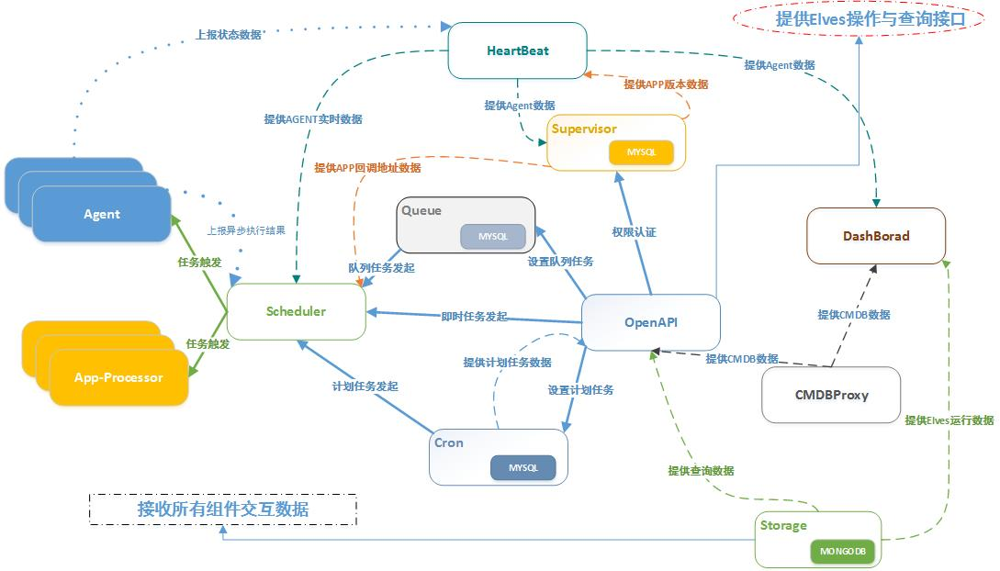
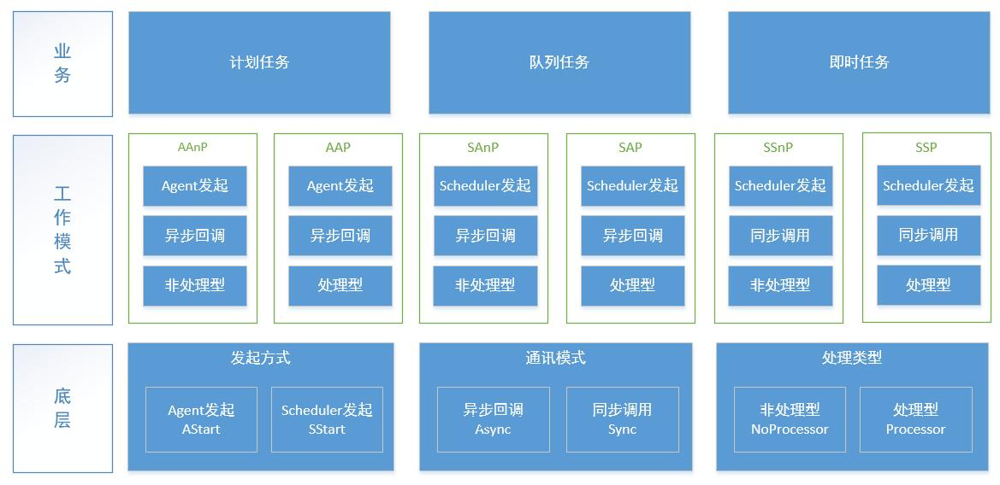
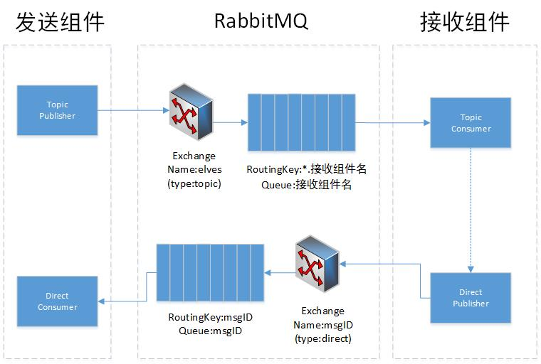
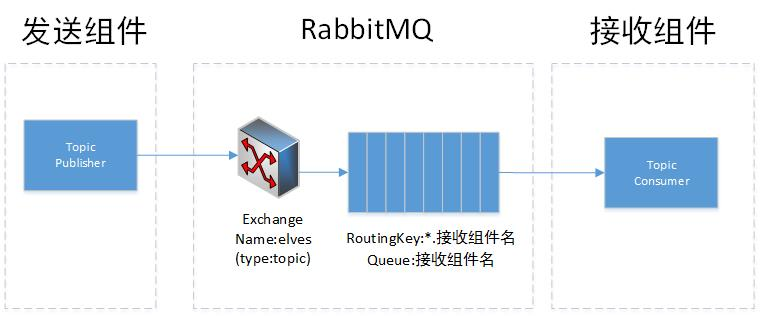

# 1	介绍 #
一套跨平台远程管理框架（Multi-machine manage framwork），支持用户根据自身的业务进行多语言应用开发

# 2	实现目标和意义 #
1. 作为系统部对机器进行远程管理的中间件
1. 实现运维人员可以在从单点触发管理目前线上的机器（Windows/Linux）
1. 使开发人员可以方便的接入远程管理系统，并通过远程管理接口操作线上机器，实现运维自动化
1. 实现机器的定时任务集中管理

**1	通讯协议、在线检测与配置文件**
Elves核心组件间交互通过RabbitMQ进行异步数据交互，Agent与Elves或外部交互均采用Thrift协议进行数据交互

**2	管理界面（control）与外部接口**
提供一套统一的接口，允许系统调用接口实现远程内部所有功能。并且基于统一接口为用户提供一套管理界面，允许用户在管理界面上进行功能使用。 

**3	应用与语言** 
支持业务应用的开发，并且支持多语言支持(Python,Java,C#)，应用支持动态加载，各组件支持热拔插

# 3	架构与组件 #

### 3.1	组件与部署结构 ###

**Scheduler**
任务调度组件,发送任务指令，回收任务结果并做后续处理。发起任务的指令来源于OpenApi组件与Cron组件，在任务执行后，Sheduler需要根据任务类型不同选择是否通知App-Processor。若需要通知，则需要向Supervisor请求App-processor信息，以便快速调用。
**详见：** [elves-scheduler 详细设计](scheduler/README.md)

**Cron**
定时任务组件，用于设置并管理Agent上的定时任务
**详见：** [elves-cron 详细设计](cron/README.md)

**Queue**
队列任务组件，用于设置并管理Agent上的队列任务
**详见：** [elves-queue 详细设计](queue/README.md)

**Supervisor**
APP管理与权限管理组件，用于管理并提供ElvesAPP信息，用于管理并提供Elves权限认证，此模块带有一个WEB化的管理后台，方便管理人员进行相应操作，认证模块目前主要向OpenAPI提供服务。
**详见：** [elves-supervisor 详细设计](supervisor/README.md)

**Heartbeat**
心跳检测组件，用于检测Agent的在线状态与向其他组件提供Agent在线状态，并且用于App的更新。
**详见：** [elves-heartbeat 详细设计](heartbeat/README.md)

**CMDBProxy**
与外部CMDB系统对接代理器，主要与部门业务系统对接
**详见：** [elves-cmdbproxy 详细设计](cmdbproxy/README.md)

**OpenAPI**
接口组件，为外部系统提供RESTFul形式接口
**详见：** [elves-openapi 详细设计](openapi/README.md)

**Storage**
查询与日志组件，监听所有组件间数据交互，并提供数据各项查询数据
**详见：** [elves-storage 详细设计](storage/README.md)

**Dashborad**
系统状态组件，主要供运维确定整套系统状态
**详见：** [elves-dashborad 详细设计](dashborad/README.md)

    以上各组件之间的数据交互均采用异步队列交互，目前Elves采用的队列为RabbitMQ,各组件的启动后均注册在Zookeeper上以进行健康状况检测，并且Zookeeper存储各组件的配置文件，并支持不重启组件的前提下进行配置文件更新。

**Elves-Agent**
主要接受来自Scheduler的指令，下载并加载相应的App-Worker，执行后将相应的执行结果发送至Scheduler端，Agent以Deamon形式运行，同时提供本身的定时自调用。
**详见：** [elves-agent 详细设计](AGENT-README.md)

**App**
Elves业务应用，Elves系统本身不提供任何业务功能，仅作为任务转发的媒介，App为加载到Elves上的业务应用，每个App对应一个或多个指令，Elves支持不限量的Apps业务，所以如果业务需要，只需要单独开发App并加载到Elves即可。
**详见：** [elves-app 详细设计](SDK-README.md)

# 3	概念与分层 #

## 3.1	通讯模式 ##
*指令的工作模式*

**异步回调(Async)**
Agent在收到指令后异步执行相应的指令内容，执行结束后通过回调方式将内容反馈至Scheduler,Agent需主动连接Scheduler

**同步调用(Sync)**
Agent在收到指令后同步执行相应的指令内容，执行结束后将直接反馈内容至Scheduler,Agent无需主动连接Scheduler

## 3.2 发起方式 ##
*指令的发起方式*

**Agent发起(Agent)**
由Agent端自发的在本地进行任务的发起

**Scheduler发起(Scheduler)**
由Scheduler端发起任务触发Agent执行任务

## 3.2	处理类型 ##
*指令的一次完整生命周期的类型*

**非处理型(NoProcessor)**
该指令在Agent上运行后执行结束

**处理型(Processor)**
该指令在Agent上运行后将执行数据通过Scheduer回调至App后执行结束

## 3.3 工作模式 ##
*根据发起方式与处理类型组合的工作模式*

**AAnP** | 工作模式：异步模式 | 发起方式：Agent发起 | 生命类型：非处理型

**SAnP** | 工作模式：异步模式  | 发起方式：Scheduler发起 |  生命类型：非处理型

**SAP** | 工作模式：异步模式 |  发起方式：Scheduler发起 |  生命类型：处理型

**SSnP** | 工作模式:同步模式  |  发起方式:Scheduler发起   |  生命类型:非处理型

**SSP** | 工作模式:同步模式  |  发起方式:Scheduler发起   |  生命类型:处理型

**详见：** [elves-workmode 工作模式详解](DETAIL-WORKMODE.md)

## 3.3	任务 ##
*Elves支持的三种不同工作类型*

**计划任务(Cron)**
根据规则周期性的执行某项任务

>支持模式：AAnP，AAP，SAnP，SAP

基础自主计划任务通过Agent存储于本地文件系统中的任务执行规则 或 通过Scheduler的任务执行规则由Scheduler进行任务指令的发送，由Agent自发的在本地进行任务的运行后结束 或 由Agent自发的在本地进行任务的运行后通过Scheduler回调至App-Processor后结束

**队列任务(Queue)**
异步并发方式地执行用户提交的某项任务
	
>支持模式：SAnP，SAP

中心计划任务通过Scheduler的任务执行规则由Scheduler进行任务指令的发送，Agent在接收到指令后进行任务的运行后结束 或 Agent在接收到指令后进行任务的运行后通过Scheduler回调至App-Processor后结束

注意：队列任务可以设置依赖关系，但当且仅当使用SAP模式才可使用其依赖功能

**即时任务(RT)**
即时阻塞方式执行用户提交的某项任务

>支持模式：SSP

及时任务为用户/第三方系统触发，并以同步调用方式在被控机上执行相应任务，实时获取相应执行结果后结束

# 5	系统设计 #

## 5.1	通讯结构体  ##

	//命令构体
	struct Instruct{
	    1 : string id,	//指令ID
	    2 : string ip,	//AgentIP
	    3 : string type, //类型(queue/cron.rt)
	    4 : string mode, //模式(sap,sanp,aap,aanp,ssp,ssnp)
	    5 : string app,	 //Elves App
	    6 : string func, //Elves App 方法
	    7 : string param, //参数JSON
	    8 : i32 timeout,  //超时时间
	    9 : string proxy  //代理器
	}
	
	//命令结果结构体
	struct Reinstruct{
	    1 : Instruct ins,
    	3 : i32 flag,
    	4 : i32 costtime,
    	5 : string result
	}

## 5.2 ZooKeeper ##

    /								Zookeeper根节点
    └─Elves							根节点,存储全局配置文件
      └─Scheduler							Scheduler根节点,存储Scheduler配置文件
          └─IP00001
      └─Auth								Auth根节点,存储Auth配置文件
          └─IP00001
      └─XXX								    XXX根节点,存储XXX配置文件
          └─IP00001

**全局配置文件存储与Elves根节点**

	{"SchedulerPort": "11000","Timeout": "80000","AgentPort": "11101","HttpRes": "http://192.168.6.116", "HttpResUSer": "admin", "HttpResPass": "1q2w3e4r"}

1. SchedulerPort ： Scheduler与Agent/App的交互端口，默认用户接口端口在此基础上加1
1. Timeout ： Scheduler与Agent/App的交互时的超时时间，只针对异步模式
1. AgentPort ： Agent对外提供服务的端口号
1. HttpRes ： HTTP资源下载地址，用户Agent端更新，Worker组件下载
1. HttpResUSer ： HTTP资源下载的账号
1. HttpResPass : HTTP资源下载的密码

## 5.3 RabbitMQ ##

各组件中的相互调用，同步与异步模式均采用此方式进行交互，方便降低各组件之间的耦合性，Elves中RabbitMQ的使用与OpenStack类似，实现OpenStack中rpc.call与rpc.cast两种类型RPC实现。

### 消息流程

**rpc.call**

**rpc.cast**

### 内容规则

消息内容均以JSON化显示，保留

- mqkey;发送组件.接收组件.方法.ID
- mqflag:错误状态，0错误,1正确
- mqerror:错误内容，

rpc-call实例：

RoutingKey : openapi.sheduler #向Agent发送异步非处理型指令

    {
        "mqkey": "openapi.sheduler.callagent.SYDHAGSY6SYAHSGA",
        "app": "webops",
        "func": "createSiteFun",
        "mode": "ssnp",
        "param": "{}"
    }
    
回复：
RoutingKey : SYDHAGSY6SYAHSGA    

    {
        "mqkey": "sheduler.openapi.callagent.SYDHAGSY6SYAHSGA",
        "mqflag": 1,
        "mqerror": ""
    }

### 交互场景

#### 基础操作

- 权限认证(openapi->supervisor->openapi)： 简称oao，用于所有以OpenApi为基础的操作，第一步进行权限的认证
- 在线监测(sheduler->heartbeat->sheduler)：简称shs，用于所有Sheduler为基础的操作，作为第一步在线检测

#### 业务

- 计划任务管理操作(oa->cron->openapi)： 用于添加，删除计划任务操作
- 发起计划任务(cron->heartbeat->cron->sheduler)：用于定时任务的发起
- 发起异步任务(sheduler->heartbeat -> *agent)，由Sheduler发起计划任务
- 发起同步任务(oa->sheduler->heartbeat->*agent->sheduler->openapi),由OpenApi发起同步任务

### 其他
设计参考： [http://www.ibm.com/developerworks/cn/cloud/library/1403_renmm_opestackrpc/]()

# 7 更新记录 #
1. 20160519 更新代码结构将最外层的quartz-spring_demo移动至3rd-lib下
2. 20160519 更新业务执行逻辑时序图，[5.1.2]，[5.1.3]，增加[5.1]章节程序架构
2. 20160523 更新接口权限设计[5.4.2.2],[5.4.2.4]，增加业务逻辑组件章节[5.1.1.3.x]
3. 20160531 修订Scheduler的命名，修订[5.5.1	目录树]Module->ModuleName->IP节点的存储内容,新增[5.5.2 全局配置文件]
4. 20160606 新增OPENAPI章节与设计文档,拆分各组件README，重新定义任务类型
5. 20160607 更新概念与分层，定义模式/类型/任务
6. 20160612 更新分层概念，增加Module结构图，修订Instruct，支持一个模块多个指令，更新数据库结构，变更
7. 20160704 更新SDK，增加Processor可接收AgentIP
8. 20161026 拆分Sheduler 
9. 20161101 更新RabbitMQ章节