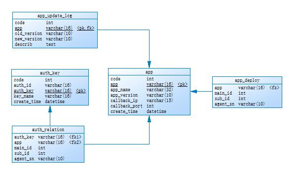

# supervisor #
## 1.简介 ##
APP管理与权限管理组件，用于管理并提供ElvesAPP信息，用于管理并提供Elves权限认证，此模块带有一个WEB化的管理后台，方便管理人员进行相应操作，认证模块目前主要向OpenAPI提供服务。

## 2.组件间关系 ##
    supervisor->heartbeat : 提供APP部署数据，heartbeat定时发送请求获取APP部署情况并告知各Agent
    supervisor->openapi : 提供权限认证，openapi将用户的authkey发送至supervisor,获取权限信息
    supervisor->scheduler :提供APP信息，主要用于处理返回型APP的回调使用
    

## 2.提供服务 ##

  - checkIpAuthByKey 用于检测AuthKEY是否可以操作此Agent
  - getAppCallbackInfo 用于获取APP的CallBACK地址信息
  - getAuthByKey 获取此AuthKEY拥有的所有权限
  - getAppDeployMd5 获取APP部署情况的MD5值，主要提供给HeartBeat用于验证部署情况使用
  - getAppDeploy 获取APP部署情况，主要提供给HeartBeat用分发部署使用

###checkIpAuthByKey 检查此Key是否有此IP权限### 
	接收
	
	{
		"mqkey":"*.supervisor.call.checkipauthbykey"
		"agentsn":"",
        "app":"",
		"auth_key":""
	}

	回复

    {
		"mqkey":"supervisor.*.call.checkipauthbykey"
        "auth_id":""
		"status":""
	}

    
###getAppInfo 获取APP回调信息###
	接收
	
	{
		"mqkey":"*.supervisor.call.getappcallbackinfo"
		"app":["",""],	

	}

	回复

    {
		"mqkey":"supervisor.*.call.getappcallbackinfo",
        "app1":{
            "appname":"",
            "appversion":"",
            "appip":"",
            "appport":""
        },
        "app2":{
            "appname":"",
            "appversion":"",
            "appip":"",
            "appport":""
        }
	}
    
###getAuthByKey 根据Key获取权限###
    接收
	
	{
		"mqkey":"*.supervisor.call.getauthbykey",
		"auth_key":""
	}

	回复

    {
		"mqkey":"supervisor.*.call.getauthbykey",
        "auth_id":"",
        "app1":{
            "main_id_list":["",""],
            "sub_id_list":["",""],
            "agent_sn_list:["",""]
        },
        "app2":{
            "main_id_list":["",""],
            "sub_id_list":["",""],
            "agent_sn_list:["",""]
        }
	}
###getAppDeployMd5 获取APPDeployMd5情况###
    接收
	
	{
		"mqkey":"*.supervisor.call.getappdeploy",
	}

	回复

    {
		"mqkey":"supervisor.*.call.getappdeploy",
        "md5":""
	}
    
###getAppDeploy 获取APPDeploy情况###
    接收
	
	{
		"mqkey":"*.supervisor.call.getappdeploy",
	}

	回复

    {
		"mqkey":"supervisor.*.call.getappdeploy",
        "main":{
            "main_id1":["",""],
            "main_id2":["",""]
        },
        "sub":{
            "sub_id1":["",""],
            "sub_id2":["",""]
        },
        "agent":{
            "agent_sn1":["",""],
            "agent_sn2":["",""]
        }
	}
    
**注意：接收组件一定使用auth_id来确认请求的合法性！**

    
## 4.Auth设计 ##
Supervisor作为整个系统的权限中心，采用AuthKEY方式授权，每一对AuthKey与AuthID组合提供一套权限认证。
  - AuthID：用于访问HTTP请求时的Sign认证
  - AuthKEY：用于记录权限
  
    
## 5.数据库模型 ##

### 设计说明：###
  - app:APP信息记录表，app_deploy:APP部署表，auth_key:权限认证表 app_relation:权限认证表，app_update_log:APP更新表
  - app_deploy表与auth_relation表支持直接为大类或小类付权，若为此类付权，则后续字段以all填充
  
## 6 其他 ##
    系统中涉及到的Agent详细信息，请分别从CMDBProxy与HeartBeat组装获取
  